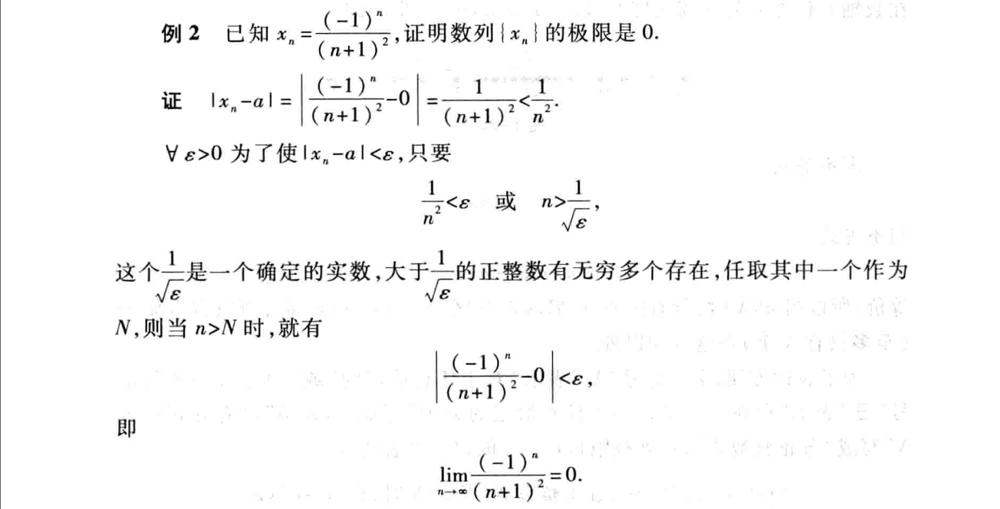
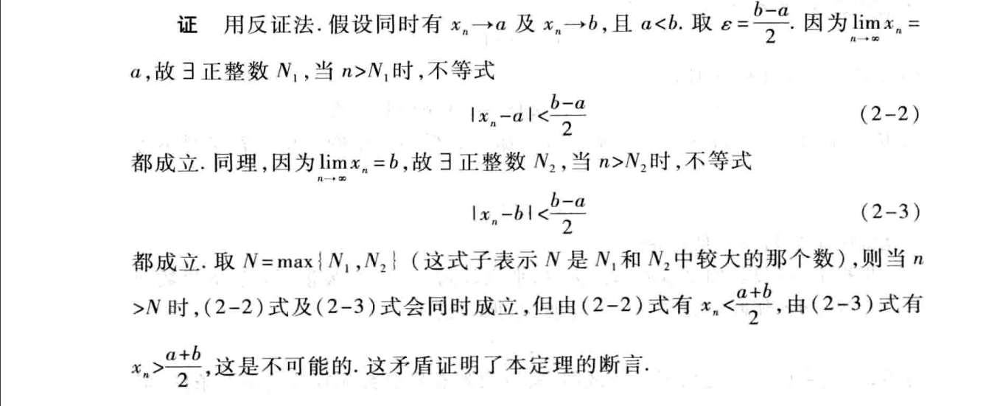
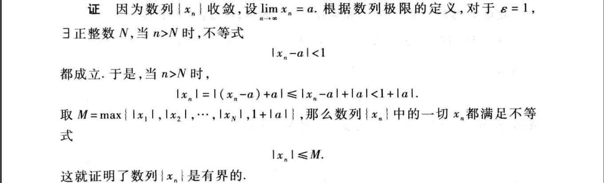
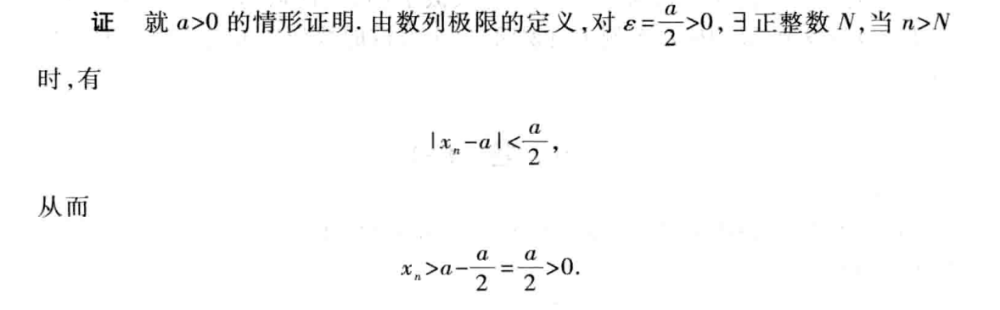

<head>
    
    
</head>

## [主页](../README.md)/[数学](./readme.md)/高等数学
### 证明数列极限
**思路**:
1. 求出数列(xn)的表达式或题目给出
2. 数列表达式减去极限值a，化简表达式。
3. 取任意e>0，|xn-a|<e,化简得到n与e的表达式。
4. 得到带有e的式子，取N大于e的式子，所以当n大于或小于N时，|xn-a|<e成立，则xn的极限为a。

### 收敛数列的性质
**定理1**：极限的唯一性
收敛数列的极限存在唯一性，只会有一个极限，证明可用反证法证明。
**证明思路**：因为只有一个极限，则可先设有两个极限a,b，且a<b，取两极限的中间值(a+b)/2，则$\exists$${N}_{1}$，使得n>${N}_{1}$时，存在
$$|{x}_{n}-a|<(b-a)\div2$$

反之证明函数为发散函数同样可以利用这一性质，只需证明函数极限不唯一，同样使用反证法。

**定理2**：（有界性）如果 数列{${x}_{n}$}收敛,那么数列{${x}_{n}$}一定有界。
**证明思路**：
此处$\epsilon$代表任意小值。
**注意**：有界是函数收敛的必要条件，不是充分条件。

**定理3**：（同号性）如果$\underset{x\rightarrow\infty}{\lim}$${x}_{n}$=a,且a>0(a<0),则存在N，当n>N时，都有${x}_{n}$>0（${x}_{n}$<0）。
**证明**：(a<0同理)
**推论**：如果从某项起有${x}_{n}$$\ge$0,（${x}_{n}$$\le$0）,且$\underset{x\rightarrow\infty}{\lim}$${x}_{n}$=a,则a$\ge$0（a$\le$0）