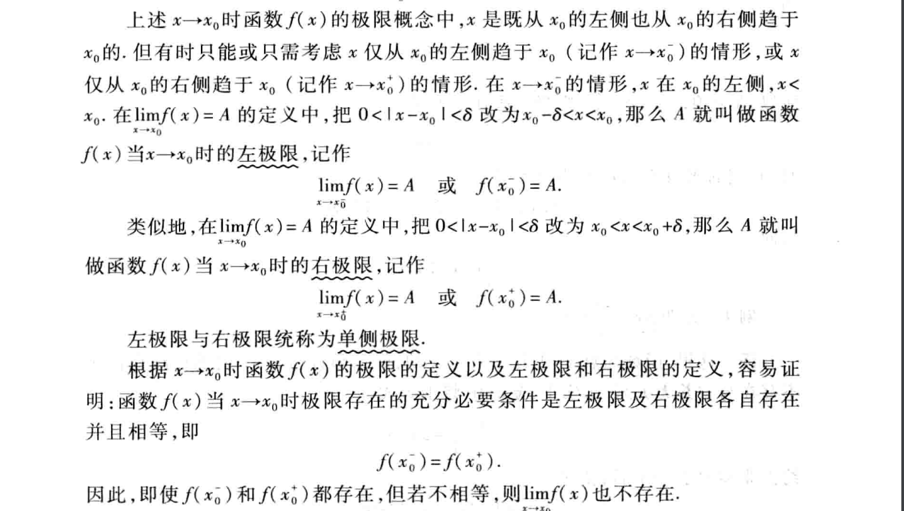

<head>
    
    
</head>

## [主页](../README.md)/[数学](./readme.md)/高等数学
### 证明数列极限
**思路**:
1. 求出数列{$x_n$}的表达式或题目给出
2. 数列表达式减去极限值a，化简表达式。
3. 取$\forall$e>0，|$x_n$-a|<e,化简得到n与e的表达式。
4. 得到带有e的式子，取N大于e的式子，所以当n大于或小于N时，|$x_n$-a|<e成立，则数列{$x_n$}的极限为a。

### 收敛数列的性质
**定理1**：极限的唯一性
收敛数列的极限存在唯一性，只会有一个极限，证明可用反证法证明。
**证明思路**：因为只有一个极限，则可先设有两个极限a,b，且a<b，取两极限的中间值(a+b)/2，则$\exists$$N_1$，使得n>$N_1$时，存在
$$|x_n-a|<(b-a)\div2$$

反之证明函数为发散函数同样可以利用这一性质，只需证明函数极限不唯一，同样使用反证法。

**定理2**：（有界性）如果 数列{ $x_n$ }收敛,那么数列{ $x_n$ }一定有界。
**证明思路**：
此处$\epsilon$代表任意小值。
**注意**：有界是函数收敛的必要条件，不是充分条件。

**定理3**：（同号性）如果  $\underset{x\rightarrow\infty}{\lim}$ $x_n$ =a,且a>0(a<0),则存在N，当n>N时，都有$x_n$>0（$x_n$<0）。
**证明**：(a<0同理)
**推论**：如果从某项起有$x_n$$\ge$0,（ $x_n$ $\le$ 0）,且        $\underset{x\rightarrow\infty}{\lim}$ $x_n$ =a,则a $\ge$ 0（a $\le$ 0）

### 函数极限的定义
**定理1**
设函数f(x)在点$x_0$的某一去心领域中有定义，如果存在常熟A，满足$\forall$$\epsilon$>0,总$\exists$$\delta$>0,满足0<|x-$x_0$|<$\delta$时，对应的函数值满足
$$|f(x)-A|<\epsilon$$
则常熟A就为f(x)的极限。
**注意**: 定义中|x-$x_0$|表示x$\neq$$x_0$,所以x$\rightarrow$$x_0$时，f(x)有没有极限。与f(x)在$x_0$有没有定义无关。
**定义一的数学表达式**
$$\underset{x\rightarrow\infty}{\lim}f(x)=A\Leftrightarrow\forall\epsilon>0,\exist\delta，当0<|x-x_0|<\delta,有|f(x)-A|<\epsilon$$

证明函数极限的思路：
先观察|f(x)-A|与|x-$x_0$|之间是否存在关系(关系可能为|f(x)-A|可以转化为|x-$x_0$|或|f(x)-A|与|x-$x_0$|存在倍数关系)，若存在关系，则可转化为$\epsilon$与$\delta$的关系，然后对于$\forall$$\epsilon$>0,$\exist$$\delta$满足上述关系，则|x-$x_0$|<$\delta$,所以|f(x)-A|<$\epsilon$,说明$\underset{x\rightarrow\infty}{lim}$f(x)=A.
**注意**：

$x^-$为左极限代表x<$x_0$
$x^+$为右极限代表x>$x_0$

### 无穷小与无穷大
**定义一：**如果函数f(x)当x$\rightarrow$0时(或x$\rightarrow$$\infty$)时的极限为零，那么则称f(x)为x$\rightarrow$0(或x$\rightarrow$$\infty$)的无穷小
**注意**：不能将无穷小与很小的数混为一谈，无穷小是这样的函数，当x$\rightarrow$0(或x$\rightarrow$$\infty$)的过程中，这函数的绝对值可以小于任意给定的正数，很小的数不行，但0是唯一可以作为无穷小的常熟，若f(x)=0，那么对于任意给定$\epsilon$>0，总有|f(x)|<$\epsilon$
**定理一:**在自变量的同一变化过程x$\rightarrow$$x_0$(或x$\rightarrow$$\infty$)中，函数f(x)具有极限A的充分必要条件为f(x)=A+a,其中a是无穷小。
**证明：**
先证明必要性，设$\underset{x\rightarrow\infty}{lim}$f(x)=A，则$\forall$$\epsilon$>0,$\exists$$\delta$>0,使得当0<|x-$x_0$|<$\delta$,有$$|f(x)-A|<\epsilon$$令a=f(x)+A,所以a是当x$\rightarrow$$x_0$时的无穷小，则$$f(x)=A+a$$
再证充分性，设f(x)=A+a,A是一个常数，a是无穷小，有$$|f(x)-A|=a$$
因为$$|a|<\epsilon$$,所以$$|f(x)-A|<\epsilon$$证明出了A是f(x)的当x$\rightarrow$$x_0$时的极限