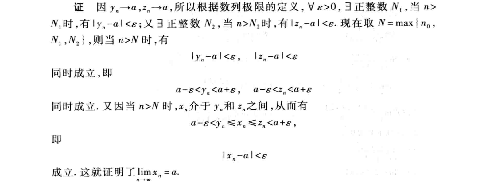

<head>
    
    
</head>

## [主页](../README.md)/[数学](./readme.md)/数学分析
### 证明数列极限
**思路**:
1. 求出数列{$x_n$}的表达式或题目给出
2. 数列表达式减去极限值a，化简表达式。
3. 取$\forall$e>0，|$x_n$-a|<e,化简得到n与e的表达式。
4. 得到带有e的式子，取N大于e的式子，所以当n大于或小于N时，|$x_n$-a|<e成立，则数列{$x_n$}的极限为a。

### 收敛数列的性质
**定理1**：极限的唯一性
收敛数列的极限存在唯一性，只会有一个极限，证明可用反证法证明。
**证明思路**：因为只有一个极限，则可先设有两个极限a,b，且a<b，取两极限的中间值(a+b)/2，则$\exists$$N_1$，使得n>$N_1$时，存在
$$|x_n-a|<(b-a)\div2$$

反之证明函数为发散函数同样可以利用这一性质，只需证明函数极限不唯一，同样使用反证法。

**定理2**：（有界性）如果 数列{ $x_n$ }收敛,那么数列{ $x_n$ }一定有界。
**证明思路**：
此处$\epsilon$代表任意小值。
**注意**：有界是函数收敛的必要条件，不是充分条件。

**定理3**：（同号性）如果  $\underset{x\rightarrow\infty}{\lim}$ $x_n$ =a,且a>0(a<0),则存在N，当n>N时，都有$x_n$>0（$x_n$<0）。
**证明**：(a<0同理)
**推论**：如果从某项起有$x_n$$\ge$0,（ $x_n$ $\le$ 0）,且        $\underset{x\rightarrow\infty}{\lim}$ $x_n$ =a,则a $\ge$ 0（a $\le$ 0）

### 函数极限的定义
**定理1**
设函数f(x)在点$x_0$的某一去心领域中有定义，如果存在常熟A，满足$\forall$$\epsilon$>0,总$\exists$$\delta$>0,满足0<|x-$x_0$|<$\delta$时，对应的函数值满足
$$|f(x)-A|<\epsilon$$
则常熟A就为f(x)的极限。
**注意**: 定义中|x-$x_0$|表示x$\neq$$x_0$,所以x$\rightarrow$$x_0$时，f(x)有没有极限。与f(x)在$x_0$有没有定义无关。
**定义一的数学表达式**
$$\underset{x\rightarrow\infty}{\lim}f(x)=A\Leftrightarrow\forall\epsilon>0,\exist\delta，当0<|x-x_0|<\delta,有|f(x)-A|<\epsilon$$

证明函数极限的思路：
先观察|f(x)-A|与|x-$x_0$|之间是否存在关系(关系可能为|f(x)-A|可以转化为|x-$x_0$|或|f(x)-A|与|x-$x_0$|存在倍数关系)，若存在关系，则可转化为$\epsilon$与$\delta$的关系，然后对于$\forall$$\epsilon$>0,$\exist$$\delta$满足上述关系，则|x-$x_0$|<$\delta$,所以|f(x)-A|<$\epsilon$,说明$\underset{x\rightarrow\infty}{lim}$f(x)=A.
**注意**：

$x^-$为左极限代表x<$x_0$
$x^+$为右极限代表x>$x_0$

### 无穷小与无穷大
#### 无穷小
**定义一：**如果函数f(x)当x$\rightarrow$0时(或x$\rightarrow$$\infty$)时的极限为零，那么则称f(x)为x$\rightarrow$0(或x$\rightarrow$$\infty$)的无穷小
**注意**：不能将无穷小与很小的数混为一谈，无穷小是这样的函数，当x$\rightarrow$0(或x$\rightarrow$$\infty$)的过程中，这函数的绝对值可以小于任意给定的正数，很小的数不行，但0是唯一可以作为无穷小的常熟，若f(x)=0，那么对于任意给定$\epsilon$>0，总有|f(x)|<$\epsilon$
**定理一:**在自变量的同一变化过程x$\rightarrow$$x_0$(或x$\rightarrow$$\infty$)中，函数f(x)具有极限A的充分必要条件为f(x)=A+a,其中a是无穷小。
**证明：**
先证明必要性，设$\underset{x\rightarrow\infty}{lim}$f(x)=A，则$\forall$$\epsilon$>0,$\exists$$\delta$>0,使得当0<|x-$x_0$|<$\delta$,有$$|f(x)-A|<\epsilon$$令a=f(x)+A,所以a是当x$\rightarrow$$x_0$时的无穷小，则$$f(x)=A+a$$
再证充分性，设f(x)=A+a,A是一个常数，a是无穷小，有$$|f(x)-A|=a$$
因为$$|a|<\epsilon$$,所以$$|f(x)-A|<\epsilon$$证明出了A是f(x)的当x$\rightarrow$$x_0$时的极限
#### 无穷大
**定理一：** 设函数f(x)在$x_0$的某一去心领域有定义(或|x|大于某一正数时有定义)，对于任意给定的正数M(无论它多大)，总存在正数$\delta$(或正数X)，只要x满足不等式0<x-$x_0$<$\delta$(或|x|>X),f(x)总满足不等式$$|f(x)|>M$$
那么称f(x)为x$\rightarrow$$x_0$(或x$\rightarrow$$\infty$)时的无穷大
**定理二：** 在自变量的同一变化过程中，若f(x)为无穷大，则1/f(x)为无穷小，若f(x)为无穷小，且f(x)不为0，则1/f(x)为无穷大

### 极限运算法则
**定理一：** 两个无穷小的和是无穷小
**证明** 设$\alpha$和$\beta$是x$\rightarrow$$x_0$时的两个无穷小，而$$\gamma=\alpha+\beta$$
$\forall$$\epsilon$>0，对于$\alpha$<$\epsilon$/2,$\exists$$\sigma_1$>0,0<|x-$x_0$|<$\sigma_1$使得$$|\alpha|<\epsilon/2$$
因为$\beta$为x$\rightarrow$$x_0$时的无穷小，对于$\epsilon$/2>0,$\exists$$\sigma_2$>0,当0<|x-$x_0$|<$\sigma_2$时，不等式$$|\beta|<\epsilon/2$$,则当0<|x-$x_0$|<$\sigma$时，有$$|\alpha|<\epsilon/2 及|\beta|<\epsilon/2$$则$|\gamma|=|\alpha|+|\beta|\le\epsilon$,就证明了$\gamma$也为无穷小。
由数学归纳法可得：**有限个无穷小加起来还是无穷小**
**定理二：** 有界函数与无穷小的乘积为无穷小。
**证明**：设函数u为某一去心领域U($x_0，\sigma_1$)内是有界的，即$\exists$M>0使|u|$\le$M,$\alpha$为$x\rightarrow$$x_0$的无穷小，即$\forall\epsilon>0$,$\exists\sigma_2$,使得0<|x-$x_0$|<$\sigma_2$ $$|\alpha|<\epsilon/M$$.
取$\sigma$=min{$\sigma_1,\sigma_2$},则当x$\in$U($x_0，\sigma_1$)时
|u$\alpha$|=|u|$\cdot$|$\alpha$|<M$\cdot$$\epsilon$/M=$\epsilon$.
所以有界函数乘以无穷小等于无穷小。
#### 推论一：
常数与无穷小的数的乘积为无穷小。
#### 推论二：
有限个无穷小的乘积是无穷小。
**定理三：**
如果$\underbar{lim}$f(x)=A,$\underbar{lim}$g(x)=B.
(1)$\underbar{lim}$[f(x)$\pm$g(x)]=$\underbar{lim}$f(x)$\pm$$\underbar{lim}$g(x)=A$\pm$B.
(2)$\underbar{lim}$[f(x)$\times$g(x)]=$\underbar{lim}$f(x)$\times$$\underbar{lim}$g(x)=A$\times$B.
**推论一：**$\underbar{lim}$[cf(x)]=c$\underbar{lim}$f(x)(c为常数)
**推论二：**$\underbar{lim}$[$f(x)^n$]=$[\underbar{lim}f(x)]^n$
(3)若有B$\neq$0,$\underbar{lim}$f(x)/g(x)=$\underbar{lim}$f(x)/$\underbar{lim}$g(x)=A/B。
定理三中的(1),(2)可推广到有限个函数的情形，则有
$\underbar{lim}$[f(x)+g(x)-h(x)]=$\underbar{lim}$
**定理四：**
存在数列$x_n$,$y_n$,$\underset{n\rightarrow\infty}{lim}x_n$,$\underset{n\rightarrow\infty}{lim}y_n$.
(1)$\underset{n\rightarrow\infty}{lim}(x_n\pm y_n)$=A+B
(2)$\underset{n\rightarrow\infty}{lim}(x_n\times y_n)$=A$\times$B
(3)当$y_0\neq$0,且B$\neq$0时，$\underset{n\rightarrow\infty}{lim}(x_n/y_n)$=A/B
**定理五：** 
若$\phi$(x)$\ge$g(x),且$\underbar{lim}\phi(x)$=A,$\underbar{lim}g(x)$=B,则A$\ge$B
**证明：**
设f(x)=$\phi$(x)-g(x),则$$\underbar{lim}f(x)=\underbar{lim}[\phi(x)-g(x)]$$
$$=\underbar{lim}\phi(x)-\underbar{lim}g(x)=A-B$$
所以f(x)$\ge$0,即A$\ge$B
**定理六（复合函数运算）：** 
设函数y=f(g(x))是由u=g(x)，与y=f(u),复合形成。若f(g(x))z$x_0$的去心领域有定义，若$\underset{x\rightarrow x_0}{lim}g(x)$=$u_0$,$\underset{u\rightarrow u_0}{lim}f(u)$=A,且存在$\sigma_0$>0,当x$\in$U($x_0,\sigma_0$),存在$\underset{x\rightarrow x_0}{lim}g(x)\neq u_0$
则$$\underset{x\rightarrow x_0}{lim}f[g(x)]=\underset{u\rightarrow u_0}{lim}f(u)=A$$
**证明：**

### 极限存在准则
**两个重要极限**
1. $\underset{x\rightarrow 0}{lim}\sin x/x$=1
2. $\underset{x\rightarrow\infty}{lim}(1+1/x)$=e
**准则一：**
如果数列{$x_n$},{$y_n$},{$z_n$}满足以下条件
(1)从某项起$\exist  n_0 \in$$N_+$,当n>$n_0$有
$$y_0 \le x_0 \le z_0$$
(2)$\underset{n\rightarrow\infty}{lim}y_n$=a,$\underset{n\rightarrow\infty}{lim}z_n$=a.
那么数列{$x_n$}存在极限，且$\underset{n\rightarrow\infty}{lim}x_n$=a。
