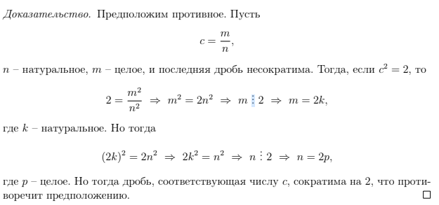
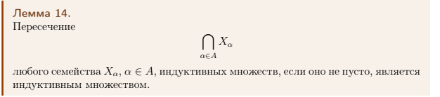
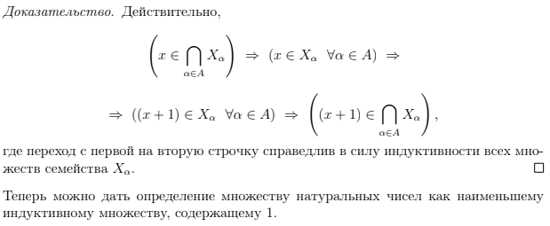
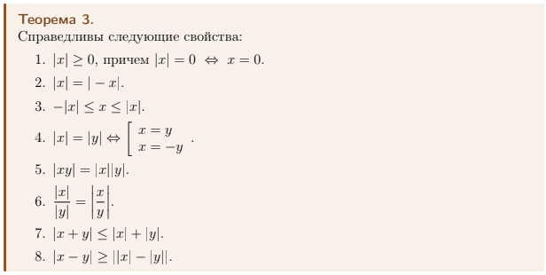
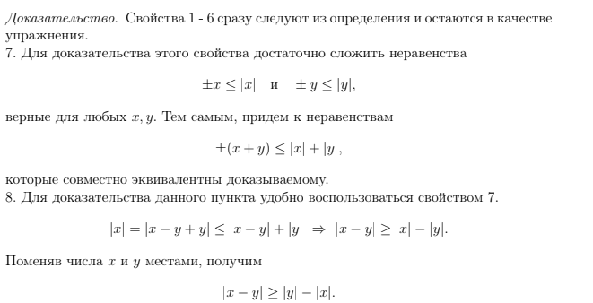

<head>
    
    
</head>

# [主页](../README.md)/[数学](./readme.md)/数学分析座谈会
## Сложение в R
https://docs.google.com/document/d/1zvC7KowxK3a5jhrnltaUDa8uSp0C-arCsVTJQ9w-sQ0/edit?usp=sharing
### Аксиомы сложения (加法公理)
**Определение**:R × R → R, называемое операцией сложения, сопостав-
ляющее каждой упорядоченной паре (x, y) из R × R элемент x + y ∈ R, называемый
суммой x и y, обладающее свойствами:
1. Операция + коммутативна, то есть для любых x, y ∈ R
$$x + y = y + x.$$

2. Операция + ассоциативна, то есть для любых x, y, z ∈ R
$$(x + y) + z = x + (y + z)$$.

3. Существует нейтральный элемент 0 ∈ R (называемый нулем), такой, что для
любого x ∈ R
$$x + 0 = x.$$

4. Для каждого элемента x ∈ R существует противоположный элемент −x такой,
что
$$x + (−x) = 0.$$
###  Леммы о единственности нуля(关于零点奇异性的定理)
**Определение**:В множестве R ноль единственен.
**Доказательство**:
$$0_1 = 0_1 + 0_2 = 0_2 + 0_1 = 0_2.$$
### единственности противоположеного элемента(相反元素的唯一性)
**Определение**:В множестве R каждый элемент имеет единственный противоположный.
**Доказательство**:
$$ x_1 = x_1 + 0 = x_1 + (x + x_2) = (x_1 + x) + x_2 = 0 + x_2= x_2 + 0 = x_2.$$
### Леммы о решении линейного уравнения.
**Определение**:В множестве R уравнение x + a = b имеет единственное решение x = b + (−a).
**Доказательство**:
Предполагая верным равенство
$$x + a = b$$и добавляя к обеим его частям −a, получаем (проследите использование аксиом
самостоятельно)
$$(x + a + (−a) = b + (−a)) ⇔ (x + 0 = b + (−a)) ⇔ (x = b + (−a))$$.
### Аксиомы умножения.
**Определение**:R×R → R, называемое операцией умножения, сопостав-
ляющее каждой упорядоченной паре (x, y) из R × R элемент x · y ∈ R, называемый
произведением элементов x и y, обладающее свойствами:
1. Операция · коммутативна, то есть для любых x, y ∈ R

$$x · y = y · x.$$

2. Операция · ассоциативна, то есть для любых x, y, z ∈ R
$$(x · y) · z = x · (y · z).$$

3. Существует нейтральный элемент 1 ∈ R \ {0} (называемый единицей), такой,
что для любого x ∈ R

$$x · 1 = x.$$

4. Для каждого элемента x ∈ R\ {0} существует обратный элемент $x^{-1}$ такой, что

$$x · x^{-1} = 1.$$

### Леммы о единственности единицы
**Определение**:В множестве R единица единственна.

### Леммы о единственности обратного элемента
**Определение**:В множестве R \ 0 каждый элемент имеет единственный обратный.

### Леммы о решении линейного уравнения.
**Определение**:В множестве R уравнение a · x = b при a ̸= 0 имеет единственное решение x = b · $a^{−1}$.

### Аксиома связи сложения и умножения
**Определение**:Умножение дистрибутивно по отношению к сложению, то есть ∀x, y, z, ∈ R
$$(x + y) · z = x · z + y · z.$$
### Лемма об умножении на ноль и следствие
**Определение**:Для любого x ∈ R выполняется
$$x · 0 = 0.$$
**Доказательство**:$$(x · 0 = x · (0 + 0)) ⇔ (x · 0 = x · 0 + x · 0) ⇔
⇔ (x · 0 + (−x · 0) = x · 0 + x · 0 + (−x · 0)) ⇔ 0 = x · 0$$
**Следствие1**:
$$(x · y = 0) ⇔ (x = 0) ∨ (y = 0).$$
### Лемма о противоположном элементе и следствия.
**Определение**:Для любого x ∈ R выполняется
$$−x = (−1) · x.$$
**Доказательство**:
Так как
$$x + (−1) · x = (1 + (−1)) · x = 0 · x = 0,$$
то, в силу единственности противоположного элемента,
$$−x = (−1) · x.$$
**Следствие1**:
Для любого x ∈ R выполняется
$$(−1) · (−x) = x.$$
**Следствие2**:
Для любого x ∈ R выполняется
$$(−x) · (−x) = x · x.$$
**Доказательство**:
$$(−x) · (−x) = (−1) · x · (−x) = x · (−1) · (−x) = x · x.$$
### Аксиомы порядка
**Определение**:Между элементами R введено отношение порядка ≤, то есть для элементов x, y ∈ R
установлено: справедливо x ≤ y, или нет. При этом выполняются следующие условия:
1. Отношение ≤ рефлексивно, то есть
$$∀x ∈ R x ≤ x.$$
2. Отношение ≤ антисимметрично, то есть

$$(x ≤ y) ∧ (y ≤ x) ⇒ (x = y).$$

3. Отношение ≤ транзитивно, то есть

$$(x ≤ y) ∧ (y ≤ z) ⇒ (x ≤ z).$$

4. Для любых двух элементов x, y ∈ R выполнено либо x ≤ y, либо y ≤ x.
### Аксиомы связи порядка со сложением и умножением. 
**Определение**:Если x, y ∈ R, то
$$(0 ≤ x) ∧ (0 ≤ y) ⇒ (0 ≤ x · y).$$
### Лемма о сравнении нуля и единицы (со вспомогательными леммами).
**Определение**:$$0 < 1.$$
**Доказательство**:
Согласно аксиоме умножения, 0 ̸= 1. Предположим, что 1 < 0,тогда, по свойствам неравенств,
$$(1 < 0) ∧ (1 < 0) ⇒ (1 · 1 > 0) ⇒ (1 > 0).$$
Так как одновременно не может выполняться 1 < 0 и 1 > 0, приходим к противоречию.
### Аксиома непрерывности
Пусть X, Y ⊂ R, причем X ̸= ∅ и Y ̸= ∅. Тогда
$$(∀x ∈ X ∀y ∈ Y x ≤ y) ⇒ (∃c ∈ R : x ≤ c ≤ y ∀x ∈ X ∀y ∈ Y ).$$
### Леммы о существовании и иррациональности числа, квадрат которого равен 2.
**Определение**:Если существует c ∈ R, что $c
^{2}$ = 2, то c – не рациональное число
**Доказательство**:

### Индуктивные множества
**Определение**:Множество X ⊂ R называется индуктивным, если
$$∀x ∈ X (x + 1) ∈ X.$$
### лемма о пересечении индуктивных множеств
**Определение**:

**Доказательство**:

### множество натуральных чисел
**Определение**:
Множеством натуральных чисел называется пересечение всех индуктивных множеств, содержащих число 1. Обозначается множество натуральных чисел как N.
### Принцип математической индукции, неравенство Бернулли
**Определение**:Если множество X ⊂ N таково, что 1 ∈ X и ∀x ∈ X (x + 1) ∈ X, то X = N.
неравенство Бернулли: $$(1 + x)^n ≥ 1 + nx, x > −1, n ∈ N.$$
**Доказательство**:Действительно, X – индуктивное множество. Так как X ⊂ N, а N
– наименьшее индуктивное множество, то X = N.
С помощью принципа математической индукции можно доказать, например, что сум-
ма и произведение натуральных чисел есть число натуральное, а также другие из-
вестные из школы свойства. Приведем пример.
### Модуль вещественного числа
**Определение**:Модулем вещественного числа x называется число, равное x, если оно положи-
тельно или равно нулю, и равное −x, если оно отрицательно. Иными словами,
$$\lvert x\rvert =
\begin{cases}
     x, x\ge0\\
     -x,x<0\\
\end{cases} $$
### Теорема о восьми свойствах
**Определение**:

**Доказательство**:

### Границы множества
**Определение**:
Множество X ⊂ R называется ограниченным сверху, если
$$∃M ∈ R : ∀x ∈ X x ≤ M.$$
Найденное число M называется верхней границей для X.
Множество X ⊂ R называется ограниченным снизу, если
$$∃m ∈ R : ∀x ∈ X x ≥ m.$$
Найденное число m называется нижней границей для X.
### ограниченность множества
**Определение**:
Множество X ⊂ R называется ограниченным, если оно ограничено как сверху,
так и снизу, то есть
$$∃M, m ∈ R : ∀x ∈ X m ≤ x ≤ M.$$
### Максимум, минимум, супремум и инфимум множества
**Определение**:
Элемент M ∈ X ⊂ R называется максимальным (наибольшим) элементом мно-
жества X, если

$$∀x ∈ X x ≤ M.$$

Обозначают это так: M = max X.

Элемент m ∈ X ⊂ R называется минимальным (наименьшим) элементом мно-
жества X, если

$$∀x ∈ X x ≥ m.$$

Обозначают это так: m = min X.
Пусть X ⊂ R ограничено сверху и не пусто. Наименьший элемент множества
верхних границ называется супремумом (или точной верхней гранью) множества
X и обозначается sup X.
В свою очередь, наибольший элемент множества нижних границ называется
инфимумом (или точной нижней гранью) множества X и обозначается inf X.
Сразу же приведем пример.
Пусть существует max X (min X). Тогда sup X = max X (inf X = min X).
### Принцип точной грани
**Определение**:
Пусть X ⊂ R, не пусто и ограничено сверху (снизу). Тогда существует един-
ственный sup X (inf X).
### следствие для любых непустых множеств
**Определение**:
У любого непустого множества X ⊂ R существуют супремум и инфимум (может
быть, равные ±∞).
### Эквивалентные определения супремума и инфимума
**Определение**:
Для супремума и инфимума можно дать следующие эквивалентные определе-
ния:

$$s = sup X ⇔ (∀x ∈ X s ≥ x) ∧ (∀s^′ < s ∃x ∈ X : x > s′),$$

$$i = inf X ⇔ (∀x ∈ X i ≤ x) ∧ (∀i^′ > i ∃x ∈ X : x < i′).$$
### Теорема о существовании максимума у любого непустого подмножества N.
**Определение**:
Теорема о существовании максимума у любого непустого подмножества N.
**Доказательство**:
Согласно принципу точной грани, существует s = sup X < +∞.
Согласно эквивалентному определению супремума,
$$∃k ∈ X : s − 1 < k ≤ s,$$

что означает, что k = max X. Действительно, во-первых k ∈ X. Во-вторых, так
как любые натуральные числа, большие k, не меньше (k + 1), а по установленному
неравенству (левая часть)

$$s < k + 1,$$

получаем, что k – верхняя грань для X. Эти два наблюдения устанавливают требу-
емое.
### Следствие о неограниченности N
**Определение**:
1. Пусть X ⊂ Z — непустое ограниченное сверху множество. Тогда существует
max X.
2. Пусть X ⊂ Z — непустое ограниченное снизу множество. Тогда существует
min X.
3. Z – неограниченное ни сверху, ни снизу множество.
### Принцип Архимеда и следствия из него.

