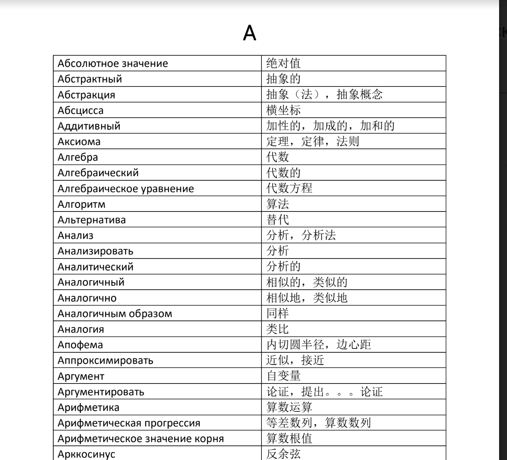
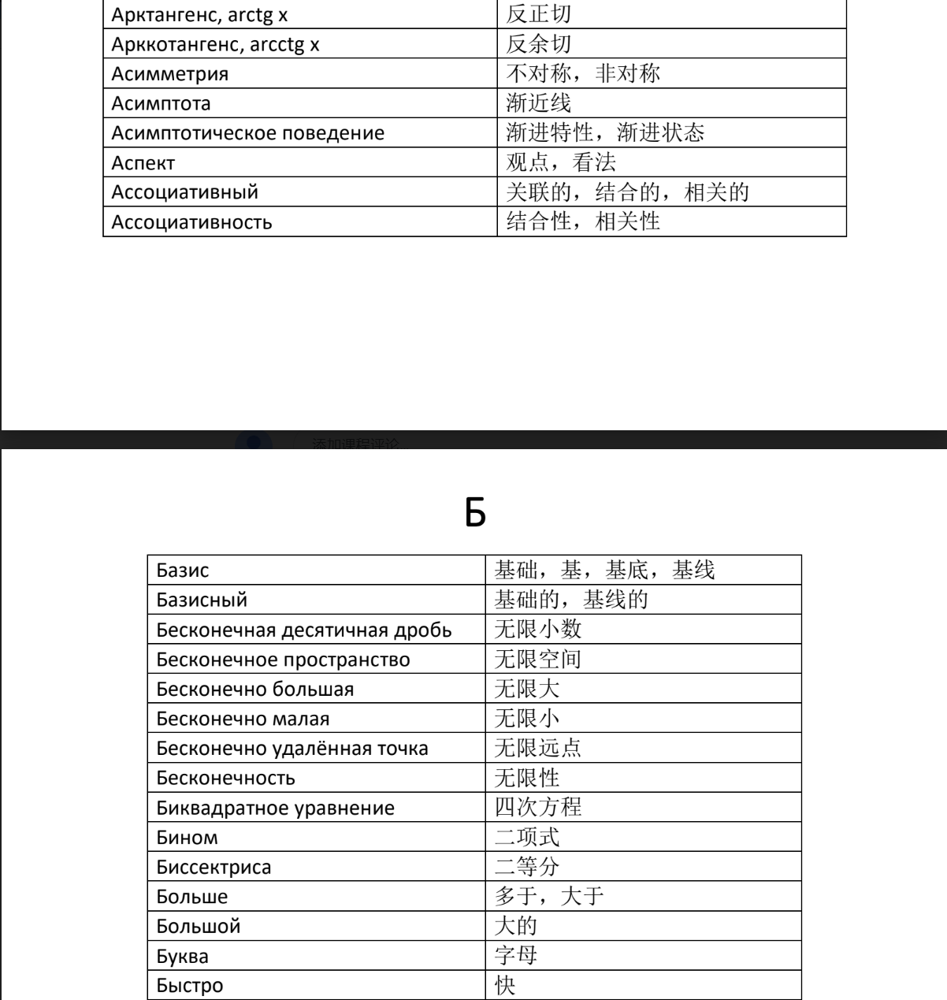
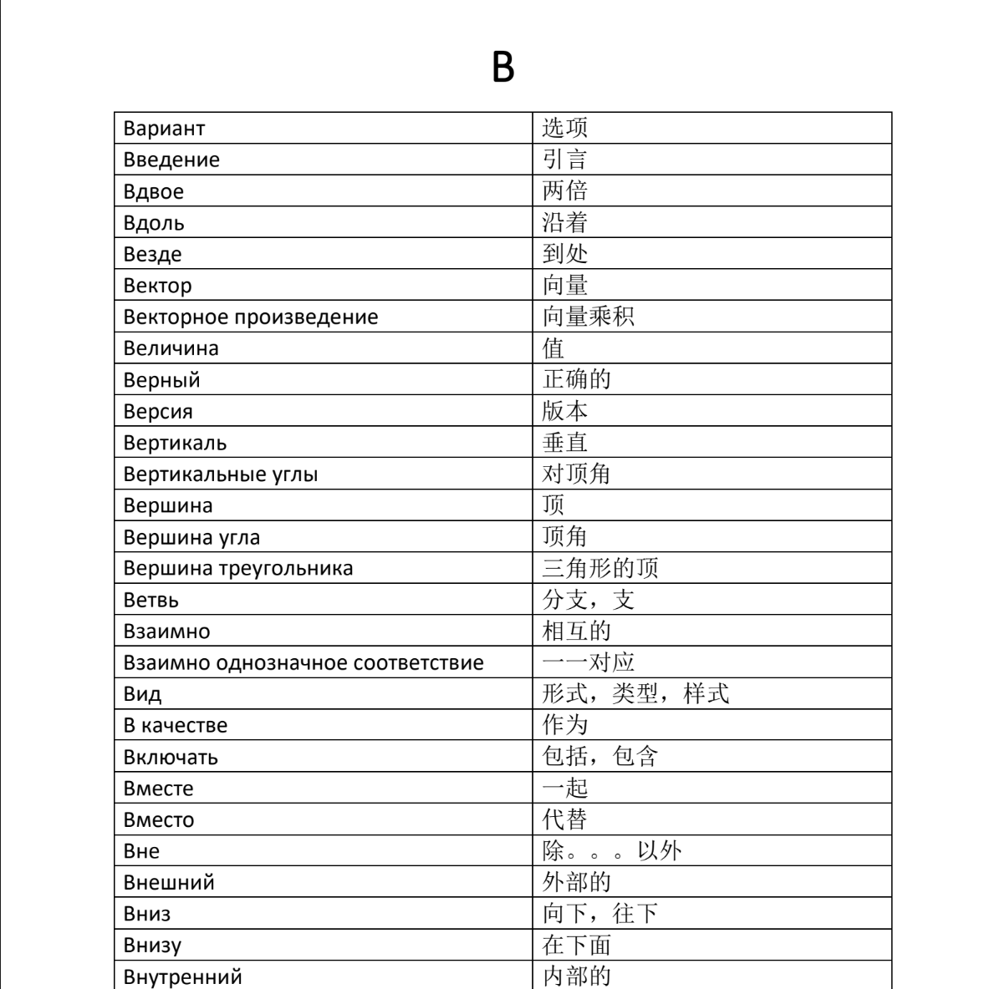
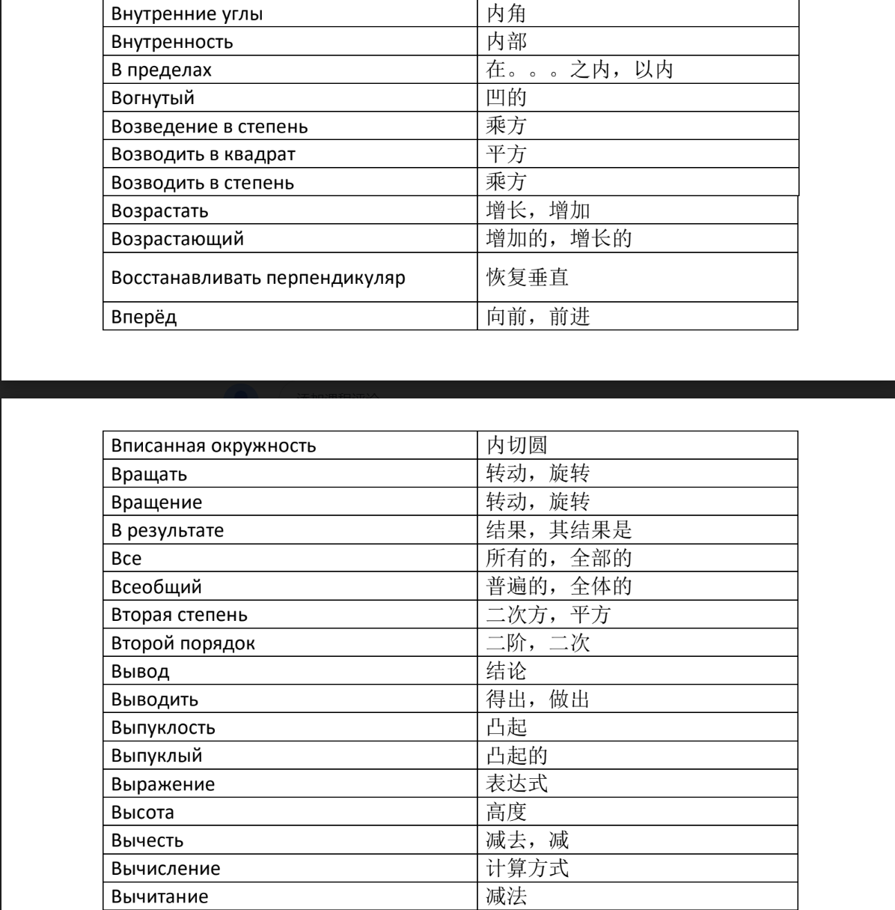

# [主页](../README.md)/[数学语言](./readme.md)/生词
## 10.17生词
1. знак 符号
2. цифра 数字
3. однозначный 一位（数）
4. буквы 字母
5. натуральный числа 自然数
6. целое число 整数
7. Арафметические действие 运算方法
8. скобки 括号
9. корень 根
10. подкоренное 根号下的
11. выражение 表达式
12. показатель 指数，幂数
13. квадратный 平方的
14. кубический 立方的
15. возведение 乘方
16. основание 底数
17. равенства 等式
18. неравенства 不等式
19. давно=пусть 假设
20. термин 专有名词
21. 
41. модуль числа а a的模
42. наибольший общий делитель 最大公约数（НОД
43. наименьшее общее кратное 最小公倍数（НОК
44. противоположные числа 相反数
## 加法词汇
1. сложение 加法
2. плюс 加
3. слагаемое 加数
4. сумма 和
## 减法词汇
1. вычитание 减法
2. минус 减
3. уменьшаемое 被减数
4. вычитаемое 减数
5. разность 差
## 乘法词汇
1. умножение 乘法
2. умножить на 乘
3. множитель 乘数
4. произведение 积
## 除法词汇
1. деление 除法
2. разделить на 除
3. делимое 被除数
4. делитель 除数
5. частное 商

## 分数
1. числитель
2. знаменатель
3. обыкновенная дробь
4. сокращением дроби
5. приведением дробей к общему знаменателю
6. 

## 专有名词

