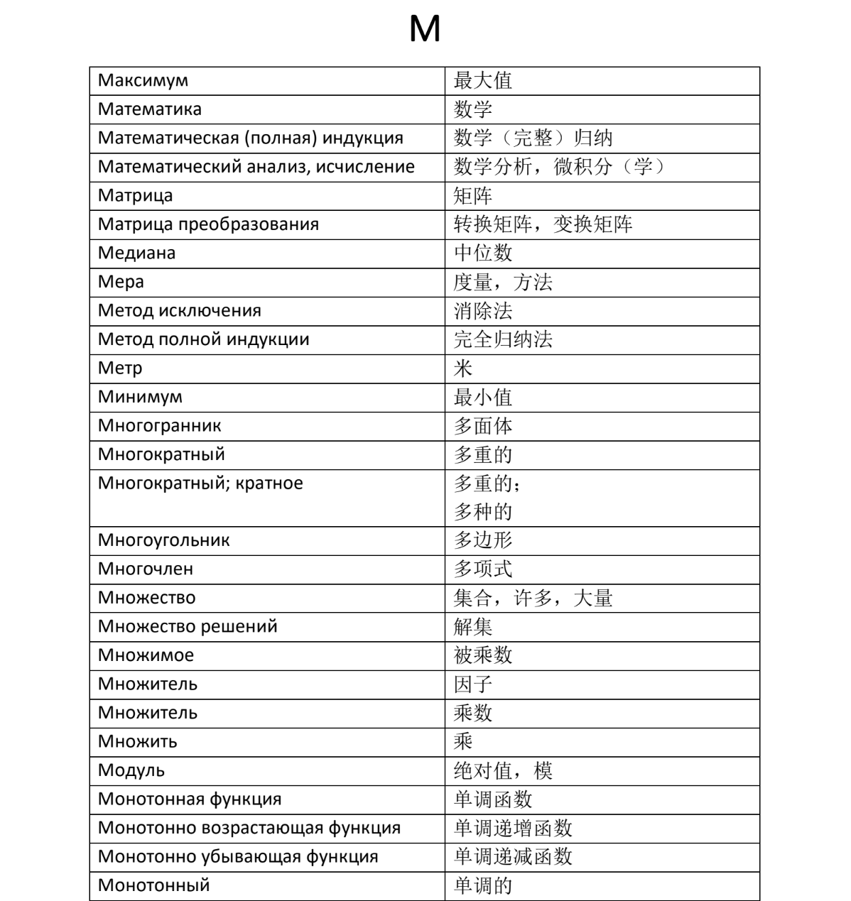
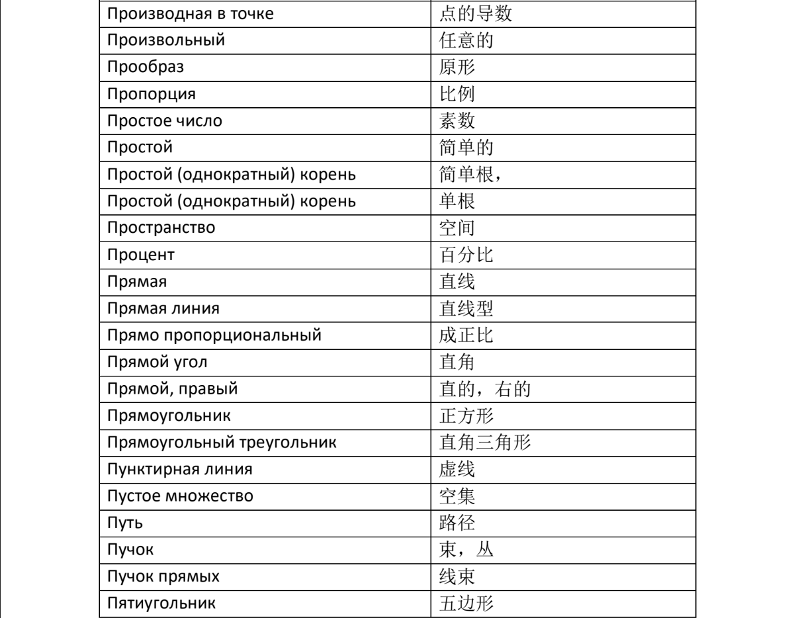

# [主页](../README.md)/[数学语言](./readme.md)/生词
## 10.17生词
1. знак 符号
2. цифра 数字
3. однозначный 一位（数）
4. буквы 字母
5. натуральный числа 自然数
6. целое число 整数
7. Арафметические действие 运算方法
8. скобки 括号
9. корень 根
10. подкоренное 根号下的
11. выражение 表达式
12. показатель 指数，幂数
13. квадратный 平方的
14. кубический 立方的
15. возведение 乘方
16. основание 底数
17. равенства 等式
18. неравенства 不等式
19. давно=пусть 假设
20. термин 专有名词
21. кратен 整除

|专有名词|意思|
|----|----|
|арифметические операции|算术运算|
|решение|解决方案|
|действие|演算|
|компоненты|组分|
|разделить с остатком|带有余数的除法|
|остаток|余数|
|алгебраическая сумма|代数和|
|положительные числа|正数|
|неположительные числа|非正数（x≤0）|
|отрицательные числа|负数|
|неотрицательные числа|非负数（x≥0）|
|абсолютная величина числа а|数字a的绝对值|
|четные числа|偶数|
|нечетные числа|奇数|
|неполное частное|不完全商|
|разложить на простые множители|因式分解|
|общий делитель|公约数|
|простое число|质数|
|составное число|合数|
|взаимно простые числа|互质|
|модуль числа а|a的模|
|наибольший общий делитель|最大公约数（НОД）|
|наименьшее общее кратное|最小公倍数（НОК）|
|противоположные числа|相反数|
|множество|集合|
|подмножество|子集|
|обыкновенная дробь|普通分数|
|знаменатель|分母|
|числитель|分子|
|основное свойство дроби|分数的主要性质|
|сократить дробь|约分|
|общий знаменатель|公分母|
|привести к общему знаменателю|通分|
|правильная дробь|真分数|
|неправильная дробь|假分数|
|смешанное число|带分数|
|целая часть|整数部分|
|дробная часть|小数部分|
|остаток|余|
|десятичная дробь|小数|
|десятичные знаки|小数点|
|обратное число|倒数|
|период|循环|
|периодическая дробь|周期分数|
|непериодическая дробь|非周期分数|
|рациональное число|有理数|
|иррациональное число|无理数|
|действительные числа\вещественные числа|实数|
|прямая|直的|
|числовая ось\числовая прямая|数轴|
|начало отсчема|原点|
|единичный отрезок|单位段|
|положительное направление|正方向|
|отрицательное направление|负方向|
|отрезок|线段|
|точка|点|
|длина|长度|
|кооордината|坐标|
|числовые интервалы|数字间隔|
|интервал|间隔|
|полуинтервал|半间隔|

## 加法词汇
1. сложение 加法
2. плюс 加
3. слагаемое 加数
4. сумма 和
## 减法词汇
1. вычитание 减法
2. минус 减
3. уменьшаемое 被减数
4. вычитаемое 减数
5. разность 差
## 乘法词汇
1. умножение 乘法
2. умножить на 乘
3. множитель 乘数
4. произведение 积
## 除法词汇
1. деление 除法
2. разделить на 除
3. делимое 被除数
4. делитель 除数
5. частное 商
## 分数/小数
1. числитель 分子
2. знаменатель 分母
3. обыкновенная дробь 简单分数
4. сокращением дроби 约分分数
5. приведением дробей к общему знаменателю 通分
6. прфвильная дробь 真分数
7. неправильная дробь 假分数
8. смешанным числом 带分数
9. бесконечной периодической десятичной дробью 无限循环小数
10. период 循环

## 专有名词

### 数学符号
