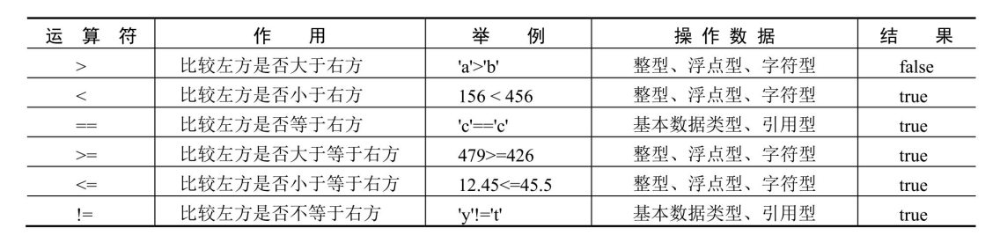
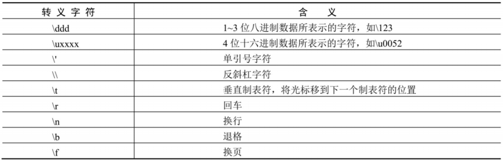
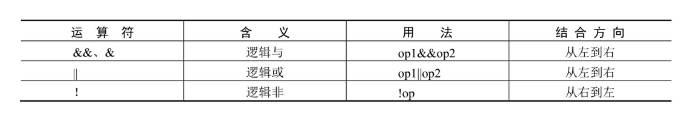
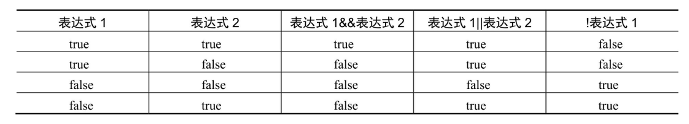
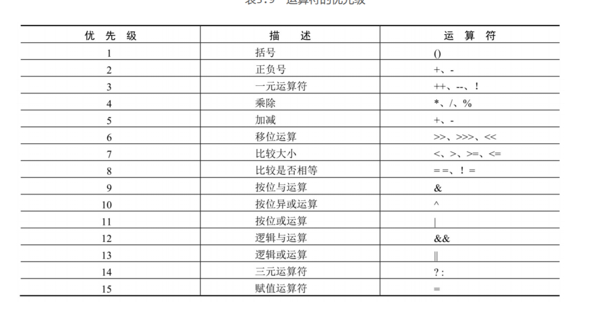

## [主页](../README.md)/[Java](./readme.md)/代码笔记

### 整数类型

|关键字|取值范围|
|:----:|:----|
|byte|（-128~127）|
|short|（-32768~32767）|
|int|（-2147483648~2147483647）|
|long|（-9223372036854775808~9223372036854775807）|

**注意**：对于long型值，若赋给的值大于int型的最大值或小于int型的最小值，则需要在数字后加L或l，表示该数值为长整数，如long num = 2147483650L。

### 浮点类型

|关键字|取值范围|
|:----:|:----|
|float|1.4E-45~3.4028235E38|
|double|4.9E-324~1.7976931348623157E308|

**注意**:在默认情况下，小数都被看作double型，若使用float型小数，则需要在小数
后面添加F或f。可以使用后缀d或D来明确表明这是一个double类型数据，不加d不
会出错，但声明float型变量时如果不加f，系统会认为变量是double类型，从而出
错。

### 比较运算符

### 变量范围
1. **成员变量**
**定义**：在类体中所定义的变量被称为成员变量，成员变量在整个类中都有效。类的成
员变量又可分为两种，即静态变量和实例变量。
2. **局部变量**
**定义**：在类的方法体中定义的变量（方法内部定义，“{”与“}”之间的代码中声明
的变量）称为局部变量。局部变量只在当前代码块中有效。

### 字符类型
1.  **char型**
在定义字符型变量时，要以单引号表示，如's'表示一个字符，而"s"则表示一个字符
串，虽然只有一个字符，但由于使用双引号，它仍然表示字符串，而不是字符。
2. **转义字符**
转义字符是一种特殊的字符变量，它以反斜杠“\”开头，后跟一个或多个字符。

### 布尔类型（逻辑类型）
**关键字**：boolean
只有true和false两个值，分别代表布尔逻辑中的“真”和“假”。
**逻辑运算符**：
**运算符的判定**：

### 代码注释
1. **单行注释**
“//”为单行注释标记，从符号“//”开始直到换行为止的所有内容均作为注
释而被编译器忽略。
**语法**：//注释内容
2. **多行注释**
“/* */”为多行注释标记，符号“/*”与“*/”之间的所有内容均为注释内
容。注释中的内容可以换行。
**语法**：/* 注释内容1 注释内容2 … */
**注意**：
在多行注释中可嵌套单行注释。例如：
/* 程序名称：Hello world //开发时间：2008-03-05 */
注意
但在多行注释中不可以嵌套多行注释，以下代码为非法：
/* 程序名称：Hello world /*开发时间：2008-03-05 作者：张先生 */ */
3. 文档注释
“/** */”为文档注释标记。符号“/**”与“*/”之间的内容均为文档注释
内容。当文档注释出现在声明（如类的声明、类的成员变量的声明、类的成员方法
声明等）之前时，会被Javadoc文档工具读取作为Javadoc文档内容。文档注释的格
式与多行注释的格式相同。对于初学者而言，文档注释并不是很重要，了解即可。

