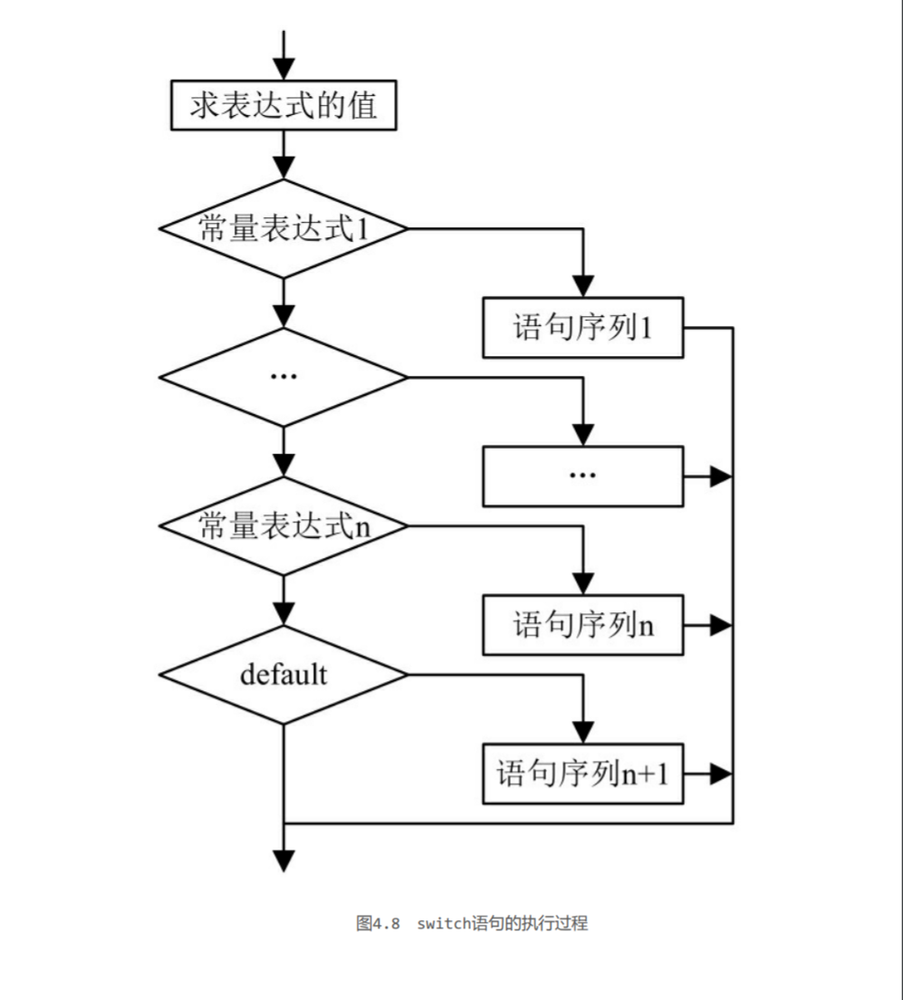

## [主页](../README.md)/[Java](./readme.md)/代码笔记

### 整数类型

|关键字|取值范围|
|:----:|:----|
|byte|（-128~127）|
|short|（-32768~32767）|
|int|（-2147483648~2147483647）|
|long|（-9223372036854775808~9223372036854775807）|

**注意**：对于long型值，若赋给的值大于int型的最大值或小于int型的最小值，则需要在数字后加L或l，表示该数值为长整数，如long num = 2147483650L。

### 浮点类型

|关键字|取值范围|
|:----:|:----|
|float|1.4E-45~3.4028235E38|
|double|4.9E-324~1.7976931348623157E308|

**注意**:在默认情况下，小数都被看作double型，若使用float型小数，则需要在小数
后面添加F或f。可以使用后缀d或D来明确表明这是一个double类型数据，不加d不
会出错，但声明float型变量时如果不加f，系统会认为变量是double类型，从而出
错。

### 比较运算符

### 变量范围
1. **成员变量**
**定义**：在类体中所定义的变量被称为成员变量，成员变量在整个类中都有效。类的成
员变量又可分为两种，即静态变量和实例变量。
2. **局部变量**
**定义**：在类的方法体中定义的变量（方法内部定义，“{”与“}”之间的代码中声明
的变量）称为局部变量。局部变量只在当前代码块中有效。

### 字符类型
1.  **char型**
在定义字符型变量时，要以单引号表示，如's'表示一个字符，而"s"则表示一个字符
串，虽然只有一个字符，但由于使用双引号，它仍然表示字符串，而不是字符。
2. **转义字符**
转义字符是一种特殊的字符变量，它以反斜杠“\”开头，后跟一个或多个字符。

### 布尔类型（逻辑类型）
**关键字**：boolean
只有true和false两个值，分别代表布尔逻辑中的“真”和“假”。
**逻辑运算符**：
**运算符的判定**：

### 代码注释
1. **单行注释**
“//”为单行注释标记，从符号“//”开始直到换行为止的所有内容均作为注
释而被编译器忽略。
**语法**：//注释内容
2. **多行注释**
“/* */”为多行注释标记，符号“/*”与“*/”之间的所有内容均为注释内
容。注释中的内容可以换行。
**语法**：/* 注释内容1 注释内容2 … */
**注意**：
在多行注释中可嵌套单行注释。例如：
/* 程序名称：Hello world //开发时间：2008-03-05 */
注意
但在多行注释中不可以嵌套多行注释，以下代码为非法：
/* 程序名称：Hello world /*开发时间：2008-03-05 作者：张先生 */ */
3. 文档注释
“/** */”为文档注释标记。符号“/**”与“*/”之间的内容均为文档注释
内容。当文档注释出现在声明（如类的声明、类的成员变量的声明、类的成员方法
声明等）之前时，会被Javadoc文档工具读取作为Javadoc文档内容。文档注释的格
式与多行注释的格式相同。对于初学者而言，文档注释并不是很重要，了解即可。

### 循环控制
1. **if语句**

1. **if…else语句**

3. **if…else if多分支语句**

4. **switch多分支语句**

5. **while循环语句**

6. **do…while循环语句**

7. **for循环语句**

### 字符串
1. **连接多个字符串**
使用“+”运算符可实现连接多个字符串的功能。“+”运算符可以连接多个运
算符并产生一个String对象。
2. **获取字符串长度**
`String str = "We are students"; int size = str.length();`
上段代码是将字符串str的长度赋值给int型变量size，此时变量size的值为
这表示length()方法返回的字符串的长度包括字符串中的空格。

### 数组
1. **数组初始化**
一维数组：`int arr = new int{1,2,5,7}`
二维数组：`type arr[][]={15,23,48,59}`

2. **遍历数组**
**一维**：`for(数据类型 变量名:要遍历的数组)`  

**二维**：遍历二维数组需使用双层for循环，通过数组的length属性可获得数组的长
度
`int[][] b=new int[][]{}`
`for(int i=0;i<b.length;i++){`
   `for(int j=0;j<b.length;j++){`
   输出结果

3. **填充数组**
`fill(int[] a,int value)`
a：要进行元素替换的数组。
value：要存储数组中所有元素的值。
**指定范围**：
`fill(int[] a,int fromIndex,int toIndex,int value)`
a：要进行填充的数组。
fromIndex：要使用指定值填充的第一个元素的索引（包括）。
toIndex：要使用指定值填充的最后一个元素的索引（不包括）。
value：要存储在数组所有元素中的值。

4. **数组排序**
`Arrays.sort(object)`
object是指进行排序的数组名称。
5. **数组复制**
   1. copyOf()方法：
   `copyOf(arr,int newlength)`
   arr：要进行复制的数组。
newlength：int型常量，指复制后的新数组的长度。如果新数组的长度大
于数组arr的长度，则用0填充（根据复制数组的类型来决定填充的值，整型数组用0
填充，char型数组则使用null来填充）；如果复制后的数组长度小于数组arr的长
度，则会从数组arr的第一个元素开始截取至满足新数组长度为止。
    2. copyOfRange()方法:
    `copyOfRange(arr,int formIndex,int toIndex)`
    arr：要进行复制的数组对象。
formIndex：指定开始复制数组的索引位置。formIndex必须在0至整个数
组的长度之间。新数组包括索引是formIndex的元素。
toIndex：要复制范围的最后索引位置。可大于数组arr的长度。新数组不
包括索引是toIndex的元素。

6. **数组查询**
   1. `binarySearch(Object[],Object key)`
   a：要搜索的数组。
key：要搜索的值。
   2. `binarySearch(Object[],int fromIndex,int toIndex,Object
key)
`
该方法在指定的范围内检索某一元素。
a：要进行检索的数组。
fromIndex：指定范围的开始处索引（包含）。
toIndex：指定范围的结束处索引（不包含）。
key：要搜索的元素。

### 对象和类
1. **抽象类**
抽象类一般指父类，指在该类中只给出该类的标准，没有给出具体的方法。
**例子**：图形类作为所有图形的父类，具有绘制图形的能
力，这个方法可以称为“绘制图形”，但如果要执行这个“绘制图形”的命令，没
有人知道应该画什么样的图形，并且如果要在图形类中抽象出一个图形对象，没有
人能说清这个图形究竟是什么图形，

2. **接口**

**例子**：接口的概念在现实中也极为常见，如从不同的五金商店买来
螺丝帽和螺丝钉，螺丝帽很轻松地就可以拧在螺丝钉上，可能螺丝帽和螺丝钉的厂
家不同，但这两个物品可以轻易地组合在一起，这是因为生产螺丝帽和螺丝钉的厂
家都遵循着一个标准，这个标准在Java中就是接口。

3. **权限修饰符**

4. **对象比较**
Java中有两种比较方式“==”和`equals`

从上述运行结果中可以看出，“==”运算符和equals()方法比较的内容是不相
同的，equals()方法是String类中的方法，它用于比较两个对象引用所指的内容是
否相等；而“==”运算符比较的是两个对象引用的地址是否相等。由于c1与c2是两
个不同的对象引用，两者在内存中的位置不同，而“String c3=c1;”语句将c1的
引用赋给c3，所以c1与c3这两个对象引用是相等的，也就是打印c1==c3这样的语句
将返回true值。
**c1,c2,c3的内存分布**

### 包装类
#### Integer类
**Integer类的常用方法**：
